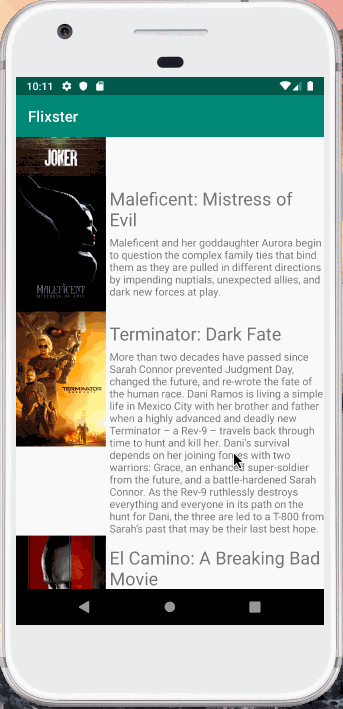

# Project 1 - *Flixster*

**Flixster** is an android app that allowsusers to see what current movies are most popular by showing the movie poster, title, and description.

Submitted by: **M. Flynn**

Time spent: **6** hours spent in total

## User Stories

The following **required** functionality is completed:

* [x] User can **view a list of movies (title, poster image, and overview) currently playing in theaters from the Movie Database API. **
* [x] User can **Expose details of movie (ratings using RatingBar, popularity, and synopsis) in a separate activity. **
* [x] User can **play video posts in full-screen using the YouTubePlayerView. **

## Video Walkthrough

Here's a walkthrough of implemented user stories:

GIF created with [LiceCap](http://www.cockos.com/licecap/).

## Notes

Describe any challenges encountered while building the app.

## License

    Copyright [yyyy] [name of copyright owner]

    Licensed under the Apache License, Version 2.0 (the "License");
    you may not use this file except in compliance with the License.
    You may obtain a copy of the License at

        http://www.apache.org/licenses/LICENSE-2.0

    Unless required by applicable law or agreed to in writing, software
    distributed under the License is distributed on an "AS IS" BASIS,
    WITHOUT WARRANTIES OR CONDITIONS OF ANY KIND, either express or implied.
    See the License for the specific language governing permissions and
    limitations under the License.
